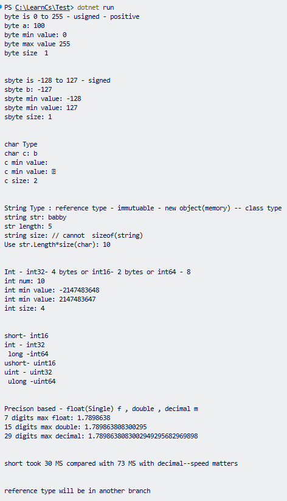

# Datatypes info about
- Size
- range of data
- Legal Operations
- Types of Results

# ONLY FOR VALUE TYPES - Predefined  except string

# Value types

## byte

## sbyte

## ASCII 

- American Standard Code for Information Interchange.

---

# Output

### Bools

- no 0 or 1 
- only use true or flase

